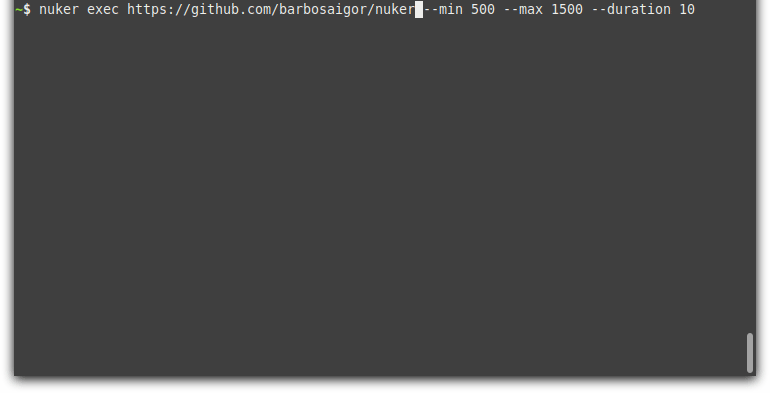

# Nuker
[](https://github.com/barbosaigor/nuker/actions/workflows/test-lint.yml)

**WIP (Work in Progress)**  _This is not the final product_    

Nuker is a CLI tool for load testing, with a powerful configuration file (but easy) for planning your tests.   
It's a suitable alternative for [JMeter](https://jmeter.apache.org/) or similar tools.  



### Features  
* High throughput with lower resource usage   
* Easy to write configuration file with an expressive config plan   
* Observability, realtime metrics and detailed log file  
* Distributed load testing, easy to run your plan among nodes   

### Install  
```sh
$ go get -u github.com/barbosaigor/nuker/...  
```

### How to use  
Run a plan file  
```sh
$ nuker run plan.yaml  
```  

Want to make a simple test? Use exec command  
```sh
$ nuker exec http://my-api.com/product/v2/123 --min 150 --max 250 --duration 10
```  

Cli details  
```sh
$ nuker help
```

### Plan file  
Nuker creates a pipeline in order to execute the test. 
The pipeline consist in stages, which have steps, which have containers. Stages and steps run sequentaily, and each container runs concurrently (within the step).  

```yaml
version: v0.0.0

stages:
  - name: my first test 
    steps:
      - name: Warm up
        containers:
          - name: product
            duration: 30 # run this container for 30 seconds
            holdFor: 10 # wait more 10 seconds with final traffic (max)
            min: 100 # start with 100 requests per second
            max: 500 # and end up to 500 requests per second
            network:
              protocol: http # default
              path: /product
              method: POST
              host: "http://0.0.0.0:8080"
              headers:
                "Content-Type": "application/json"
                "Authorization": "cGFzc3dvcmQK"
              body: '{"id": "123-abc", "quantity": 10}'
          - name: stock
            duration: 11 # run this container for 11 seconds
            holdFor: 30 # wait more 30 seconds with final traffic (max)
            min: 1 # start with 1 request per second
            max: 5 # and end up to 5 requests per second
            network:
              path: "/stock?q=my%20stockiscool&bla=foo"
              method: GET # default
              host: "http://0.0.0.0:8080"
          - name: fee
            duration: 5 # run this container for 5 seconds
            holdFor: 30 # wait more 30 seconds with final traffic (max)
            min: 9 # start with 9 requests per second
            max: 18 # and end up to 18 requests per second
            network:
              path: /fee
              host: "http://0.0.0.0:8080"
```

### Distributed plan 
Distrubuted plan works with master-slave approach.  
A master node will orchestrate all pipeline workload among slaves (workers).  
Each worker should connect to the master nuker, following master URL.   

Start a master nuker:  
```sh
# --min-workers defines how many workers should master wait before start pipeline (default 1)
$ nuker run plan.yaml --master
master URL: http://master-ip.io/
```

Connect a worker into master:  
```sh
$ nuker worker http://master-ip.io/ 
```  

After that, master would be able to balance the workload among workers.  
